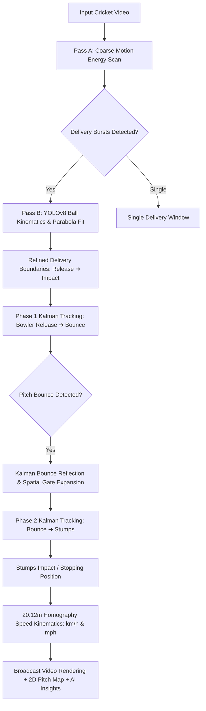

# 🏏 HawkVision: AI-Powered Cricket Ball Trajectory, Kinematics & Bowling Analytics

[](https://www.python.org/)
[](https://github.com/ultralytics/ultralytics)
[](https://flask.palletsprojects.com/)
[](https://opencv.org/)
[](colab_hawkvision.ipynb)

**HawkVision** is a broadcast-grade cricket ball tracking and bowling analytics platform. It automatically detects, tracks, and analyzes cricket deliveries from practice or match videos using **YOLOv8 computer vision**, **two-phase Kalman filtering with bounce reflection**, real-world **pitch kinematics**, an interactive **2D pitch trajectory canvas**, and **Gemini AI bowling coaching**.

---

## 🌟 Key Features

### 1. 🎯 Two-Phase Trajectory Tracking & Bounce Reflection
- **Phase 1 (Pre-Bounce)**: Tracks the delivery arc from bowler release to pitch impact in glowing Amber (`#f59e0b`).
- **Pitch Bounce Reflection**: Automatically reflects vertical Kalman velocity ($v_y$) upon ground contact with energy damping ($e=0.55$) and dynamic spatial gating.
- **Phase 2 (Post-Bounce)**: Seamlessly tracks the ball off the pitch to batsman/stumps in Electric Cyan (`#00e5ff`).
- **Wicket Hit Detection**: Pinpoints stump impact or crease stopping location with high precision.

### 2. ✂️ Multi-Shot Auto-Segmentation
- **Pass A (Coarse Motion Windows)**: Downsampled frame-differencing scans the video for bursts of motion and separates deliveries from dead-time intervals.
- **Pass B (YOLO Ball Kinematics)**: Validates projectile curves ($R^2 > 0.40$), identifies precise release and impact frames, and splits bowling spells into independent deliveries.
- **Anti-Bleed Safeguard**: Prevents cross-delivery trajectory hooking by rejecting backward jumps and disjointed detections.

### 3. ⚡ Real-World Pitch Kinematics
- Converts pixel displacement into physical metrics calibrated to the standard **20.12m (22 yards)** pitch.
- Computes **Release Speed**, **Pitch Bounce Speed**, **Average Flight Speed**, and **Peak Speed** in both **km/h** and **mph**.
- Calculates delivery trajectory angles and detects bounce deviations.

### 4. 🏟️ Interactive 2D Pitch Canvas & Stumps Reticle
- High-fidelity bird's-eye canvas view of the cricket wicket.
- Allows switching between individual delivery trajectories (`Shot 1`, `Shot 2`, `Shot 3`) or inspecting the full multi-delivery **Overlay All** view.
- Marks pitch bounce points with radar rings and highlights stump impacts with target reticles.

### 5. 🎬 Broadcast UI & Video Controls
- Full continuous video playback and independent delivery clip views.
- Instant slow-motion controls: **1x (Normal)**, **0.5x (Slow-Mo)**, and **0.25x (Super Slow-Mo)**.
- Dark/Light broadcast theme toggle with sleek glassmorphic HUD.

### 6. 🤖 Gemini AI Bowling Coach
- Analyzes delivery consistency, pace variations, bounce distribution, and line & length.
- Delivers actionable coaching verdicts and tactical advice for fast bowlers and spinners.

---

## 📂 Project Structure

```
hawkvision/
├── app.py                     # Web server launcher (port 8088)
├── server.py                  # Flask backend API, async processing, history & Gemini integration
├── trajectory_tracker.py      # Core CV engine: YOLOv8 tracking, Kalman bounce reflection, segmentation
├── speed_tracker.py           # Real-world pitch kinematics & calibration (20.12m pitch)
├── predict.py                 # Standalone CLI runner for headless & GPU execution
├── colab_hawkvision.ipynb     # 1-Click Google Colab GPU notebook
├── templates/
│   ├── index.html             # Main analytics dashboard & video player
│   └── history.html           # Historical delivery catalog & session reloader
├── static/
│   ├── app.js                 # Frontend application controller & HUD logic
│   └── style.css              # Broadcast dark/light design system
├── runs/detect/train5/weights/
│   └── best.pt                # Fine-tuned YOLOv8 cricket ball detection model
├── videos/
│   └── test1.mp4              # Sample test video
├── requirements.txt           # Python dependencies
└── README.md                  # Project documentation
```

---

## 🚀 Quickstart

### Prerequisites
- Python 3.9, 3.10, or 3.11
- FFmpeg installed on system PATH (or `imageio-ffmpeg`)
- Optional: NVIDIA CUDA GPU for accelerated inference

### 1. Clone the Repository
```bash
git clone https://github.com/123harshitaagrawal/hawkvision.git
cd hawkvision
```

### 2. Install Dependencies
```bash
pip install -r requirements.txt
pip install ultralytics imageio-ffmpeg
```

### 3. Run the Web Application
```bash
python app.py
```
Open your browser and navigate to: **`http://localhost:8088`**

---

## ⚡ Running on Google Colab (Free GPU)

You can run the core trajectory prediction on a free NVIDIA T4 GPU in Google Colab without any local setup:

1. Upload [`colab_hawkvision.ipynb`](colab_hawkvision.ipynb) to [Google Colab](https://colab.research.google.com).
2. Set Runtime: **Runtime** → **Change runtime type** → **T4 GPU**.
3. Run the notebook cells to execute tracking and view the output video directly inside the browser.

Or run the CLI directly:
```bash
python predict.py --video videos/test1.mp4 --model runs/detect/train5/weights/best.pt --no-show
```

---

## 💻 CLI Usage (`predict.py`)

You can run HawkVision on any video directly from the command line:

```bash
# Basic usage with auto-trim and fine-tuned model
python predict.py --video path/to/cricket_video.mp4 --no-show

# Specify custom model weights, confidence, and output path
python predict.py \
    --video videos/test1.mp4 \
    --model runs/detect/train5/weights/best.pt \
    --conf 0.25 \
    --output videos/annotated_delivery.mp4 \
    --no-show

# Force GPU or CPU execution
python predict.py --video videos/test1.mp4 --device 0    # CUDA GPU
python predict.py --video videos/test1.mp4 --device cpu  # CPU
```

### CLI Arguments:
| Argument | Flag | Default | Description |
| :--- | :--- | :--- | :--- |
| `--video` | `-v` | `videos/test1.mp4` | Path to input cricket video |
| `--output` | `-o` | `videos/output_predicted.mp4` | Path to save annotated output video |
| `--model` | `-m` | `runs/detect/train5/weights/best.pt` | Path to YOLOv8 weights |
| `--conf` | `-c` | `0.25` | Ball detection confidence threshold |
| `--device` | `-d` | `auto` | Target compute device (`0` for GPU, `cpu` for CPU) |
| `--no-trim` | | `False` | Disable auto-segmentation and process entire video |
| `--no-show` | | `False` | Disable live OpenCV GUI window (mandatory for Colab/Docker) |

---

## 🔬 How the Tracking Engine Works



---

## 🛠️ Technology Stack

- **Computer Vision**: Ultralytics YOLOv8, OpenCV (`cv2`), NumPy, SciPy
- **State Estimation**: 2-Phase Extended Kalman Filter with vertical velocity reflection
- **Kinematics Engine**: Perspective-scaled homography (20.12m pitch calibration)
- **Web Backend**: Flask, Python ThreadPoolExecutor, HTTP Range Streaming (RFC 7233)
- **AI Coaching**: Google Gemini API integration
- **Frontend**: Vanilla JavaScript (ES6+), Vanilla CSS3 Glassmorphism, HTML5 Canvas 2D

---

## 📄 License

This project is licensed under the MIT License. See the [LICENSE](LICENSE) file for details.
